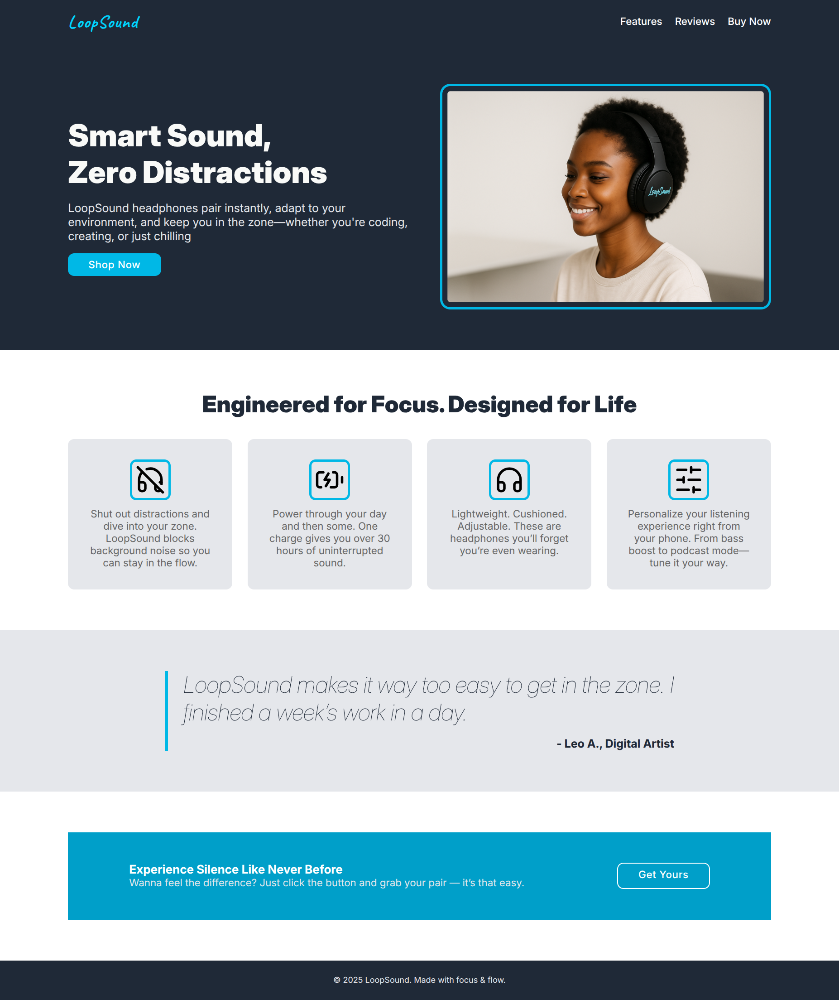

# LoopSound Landing Page

A clean, responsive landing page built as part of [The Odin Project's Foundations course](https://www.theodinproject.com/paths/foundations/courses/foundations/lessons/landing-page). It focuses on HTML/CSS layout fundamentals, using Flexbox and semantic structure.

## Live Demo

View the live site here:  
[https://odhiambovinogola.github.io/odin-landing-page/](https://odhiambovinogola.github.io/odin-landing-page/)

## Table of Contents

- [Overview](#overview)
- [Built With](#built-with)
- [What I Learned](#what-i-learned)
- [Challenges](#challenges)
- [Getting Started](#getting-started)
- [Acknowledgements](#acknowledgements)

## Overview

This project replicates a modern landing page layout using only HTML and CSS. The goal was to put flexbox to the test and build a clean, structured page with semantic markup and visual hierarchy.



**Key Features:**

- Semantic layout using `section`, `header`, `footer`, and more
- Flexbox for layout and responsiveness
- Custom buttons with hover states
- Clean, consistent typography and spacing
- Clear sectioning and component styling

## Built With

- HTML5
- CSS3
- Flexbox
- Google Fonts (Inter & Caveat)

## What I Learned

- Structuring a static page using semantic HTML tags
- Aligning and spacing content with flexbox
- Styling buttons with utility classes and hover effects
- Creating visual flow using consistent sizing (`rem`) and colors
- How small design tweaks (like borders, padding, line height) elevate a page

## Challenges

I didn’t document them all this round (note to future self: do that next time 💡), but a few included:

- Debated the use of `<a>` vs `<button>` elements for CTAs on a static page—chose `<a>` for clarity and accessibility.
- Refactored button styles to reduce repetition by introducing a base `.btn` class with modifier classes.
- Practiced better Git commit discipline by staging smaller chunks and splitting logic where necessary.

## Getting Started

To view or edit locally:

1. Clone this repo:

   ```bash
   git clone https://github.com/odhiambovinogola/odin-landing-page.git
   ```

2. Open index.html

## Acknowledgements

- [The Odin Project](https://www.theodinproject.com/) for the curriculum and project brief
- [Google Fonts](https://fonts.google.com/) for font resources
- Inspired by the reference design included in The Odin Project landing page lesson
